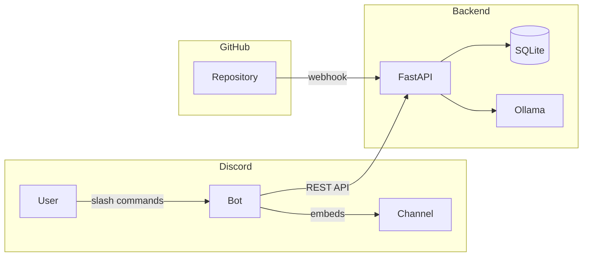
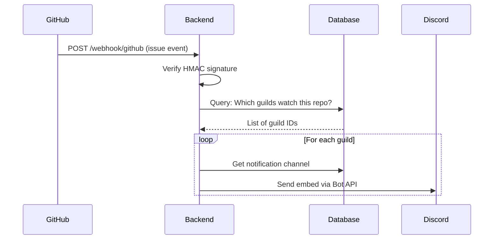
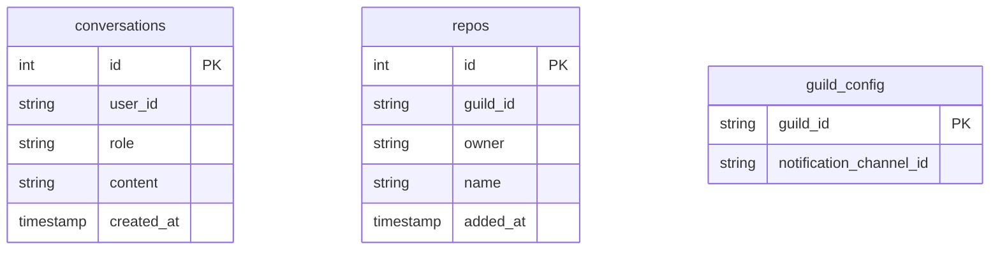

# DevBot

A full-stack Discord bot featuring AI-powered chat and GitHub issue notifications, built with TypeScript and Python.

[](https://www.typescriptlang.org/)
[](https://www.python.org/)
[](https://discord.js.org/)
[](https://fastapi.tiangolo.com/)
[](LICENSE)

---

## Features

- **AI Chat** — Natural conversations powered by Ollama with per-user memory
- **GitHub Notifications** — Real-time issue alerts delivered to your Discord channels
- **Multi-Server Support** — Per-guild configuration for repos and notification channels
- **Secure Webhooks** — HMAC-SHA256 signature verification for GitHub events

---

## Architecture



| Layer | Technology | Purpose |
|-------|------------|---------|
| **Bot** | TypeScript, discord.js | Discord interactions, slash commands |
| **Backend** | Python, FastAPI | Business logic, API endpoints |
| **AI** | Ollama (llama3) | Conversational AI with context |
| **Database** | SQLite (aiosqlite) | Conversations, repos, guild config |

---

## Commands

| Command | Description |
|---------|-------------|
| `/ping` | Health check |
| `/status` | Backend status with uptime |
| `/chat <message>` | AI conversation with memory |
| `/clear` | Clear your chat history |
| `/repos list` | Show watched repositories |
| `/repos add <owner> <name>` | Watch a GitHub repository |
| `/repos remove <owner> <name>` | Stop watching a repository |
| `/setchannel <channel>` | Set notification channel for GitHub events |

---

## GitHub Notifications

When issues are opened, closed, or reopened in watched repositories, DevBot sends rich embeds to your configured channel:



**Embed Colors:**
- 🟠 **Orange** — Issue opened
- ⚪ **Gray** — Issue closed
- 🟢 **Green** — Issue reopened

---

## Project Structure

```
devbot/
├── bot/                      # TypeScript Discord bot
│   └── src/
│       ├── index.ts          # Entry point, event routing
│       ├── config.ts         # Zod environment validation
│       ├── deploy-commands.ts
│       └── commands/
│           ├── ping.ts
│           ├── status.ts
│           ├── chat.ts
│           ├── clear.ts
│           ├── repos.ts      # Subcommands: list, add, remove
│           └── setchannel.ts
│
├── backend/                  # Python FastAPI server
│   └── app/
│       ├── main.py           # App entry, lifespan events
│       ├── config.py         # Pydantic Settings
│       ├── database.py       # SQLite schema & connection
│       ├── schemas.py        # Request/response models
│       ├── routers/
│       │   ├── chat.py       # AI chat endpoints
│       │   ├── guilds.py     # Repo & config management
│       │   └── github.py     # Webhook receiver
│       └── services/
│           ├── ollama.py     # Ollama API client
│           └── discord.py    # Discord API client
│
└── data/                     # SQLite database (gitignored)
```

---

## Quick Start

### Prerequisites

- Node.js 18+
- Python 3.10+
- [uv](https://docs.astral.sh/uv/) — `curl -LsSf https://astral.sh/uv/install.sh | sh`
- [Ollama](https://ollama.ai/) — `ollama pull llama3`
- Discord bot token from [Developer Portal](https://discord.com/developers/applications)

### 1. Clone & Configure

```bash
git clone https://github.com/hwang-fu/devbot.git
cd devbot
```

Create `bot/.env`:
```env
DISCORD_TOKEN=your_bot_token
DISCORD_CLIENT_ID=your_client_id
BACKEND_URL=http://localhost:8000
```

Create `backend/.env`:
```env
DISCORD_TOKEN=your_bot_token
OLLAMA_MODEL=llama3
```

### 2. Start Backend

```bash
cd backend
uv sync
uv run uvicorn app.main:app --reload
```

### 3. Start Bot

```bash
cd bot
npm install
npx tsx src/deploy-commands.ts  # Register commands (once)
npm run dev
```

---

## API Reference

### Chat
| Method | Endpoint | Description |
|--------|----------|-------------|
| `POST` | `/chat` | Send message, receive AI response |
| `POST` | `/chat/clear` | Clear user's conversation history |

### Guild Management
| Method | Endpoint | Description |
|--------|----------|-------------|
| `GET` | `/guilds/{id}/repos` | List watched repos |
| `POST` | `/guilds/{id}/repos` | Add repo to watch |
| `DELETE` | `/guilds/{id}/repos/{owner}/{name}` | Remove watched repo |
| `GET` | `/guilds/{id}/config` | Get guild configuration |
| `PUT` | `/guilds/{id}/config` | Update notification channel |

### Webhooks
| Method | Endpoint | Description |
|--------|----------|-------------|
| `POST` | `/webhook/github` | Receive GitHub events |

### Health
| Method | Endpoint | Description |
|--------|----------|-------------|
| `GET` | `/health` | Status, uptime, version |

---

## Development

```bash
# Backend
uv run uvicorn app.main:app --reload   # Dev server
uv run ruff check . --fix              # Lint
uv run ruff format .                   # Format

# Bot
npm run dev                            # Dev server
npm run lint                           # ESLint
npm run format                         # Prettier
```

---

## Configuration

### Bot Environment Variables

| Variable | Required | Description |
|----------|:--------:|-------------|
| `DISCORD_TOKEN` | ✓ | Bot token |
| `DISCORD_CLIENT_ID` | ✓ | Application ID |
| `BACKEND_URL` | ✓ | Backend API URL |

### Backend Environment Variables

| Variable | Default | Description |
|----------|---------|-------------|
| `DISCORD_TOKEN` | — | Bot token (for sending notifications) |
| `OLLAMA_HOST` | `http://localhost:11434` | Ollama API URL |
| `OLLAMA_MODEL` | `llama3` | Model name (verified on startup) |
| `DATABASE_PATH` | `../data/devbot.db` | SQLite database path |
| `GITHUB_WEBHOOK_SECRET` | — | Webhook signature secret |

---

## Database Schema



---

## License

MIT © [Junzhe Wang](mailto:junzhe.wang2002@gmail.com)
